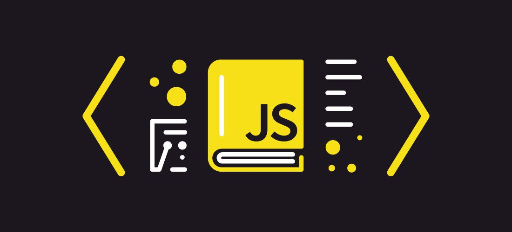

# Tutorial

Các lập trình trình viên hay nhà phát triển phần mềm JS, ngày nay có thể làm mọi thứ từ thiết kể giao diện trang web đến tạo trò chơi máy tính, tiện ích máy tính để bàn, ứng dụng di động đa nền tảng hoặc là xây dựng máy chủ \(với nodejs\) để kết nối với bất kỳ cơ sở dữ liệu nào, có thể thấy javascript đã đạt được sự phổ biến đến mức không thể tượng tượng. Do đó, việc quan trọng lúc này là phải hiểu các cấu trúc bên trong JavaScript để có thể code tốt và hiệu quả hơn và đó cũng là mục đích cho bài viết này.

Điều mà tất cả các Dev JS cần phải làm đầu tiên trước khi đi sâu vào sử dụng framework hay thư viện đang nổi trên thị trường là phải hiểu nền tảng cơ bản về tất cả những điều được thực thi ở cấp độ cơ sở :

1. Scope
2. IIFE
3. Hoisting
4. Object
5. Prototype
6. Callbacks
7. Promise
8. Async/Await

