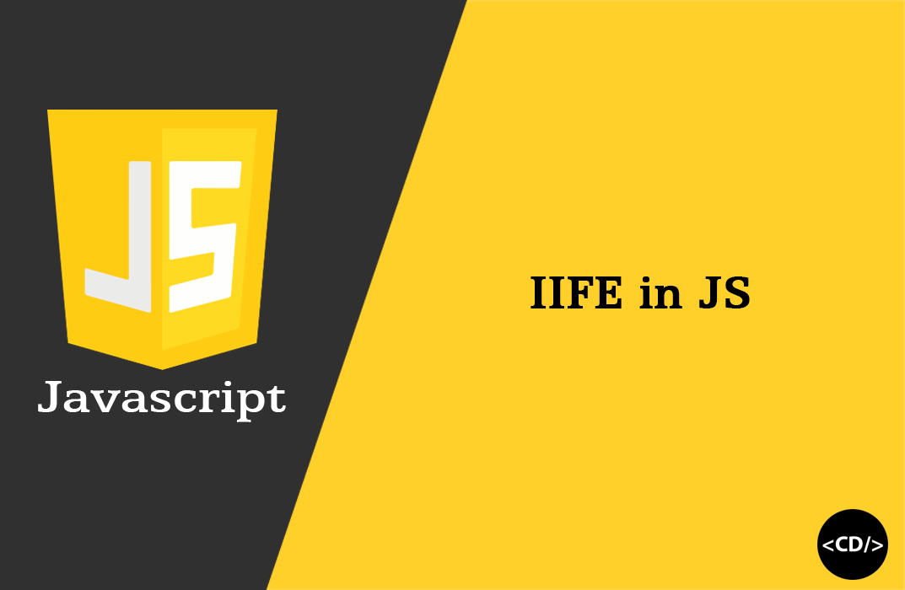

# IIFE



IIFE là viết tắt của **Immediately Invoked Function Expression,** nó là một dạng viết Function trong JS và nó sẽ được chạy ngay sau khi nó được khởi tạo.

Dạng function này có rất nhiều lợi ích như: Sẽ làm block các biến global, đỡ tốn bộ nhớ \(Vì khởi tạo cái là chạy luôn, sau đó sẽ được clean khỏi memory\), sẽ không cần khởi tạo Function global tránh polluted \(Ô nhiễm\) Global namespace.

Trước khi nói đến IIFE chúng ta hãy xem một function bình thường được định nghĩa và được exucute như thế nào nhé.

```javascript
function func() {
    // Do something
}

func();
```

Và như vậy khi chúng ta khai báo function đồng thời lại vô tình gắn nó vào memory sau đó gọi lại, nó sẽ là rất hay nếu như chúng ta gọi lại hàm này và coi nó như một hàm Common, gọi đi gọi lại nhiều lần. Khi đó cách khai báo function như trên là rất hợp lý, tuy nhiên hãy giả sử trường hợp là chúng ta chỉ cần gọi hàm đó 1 lần và ngay sau khi mà window được load xong chẳng hạn thì sẽ cần bỏ hàm đó vào trong `$(document).ready()` hoặc `window.onload` trong hợp như này thì nên dùng IIFE để memory được nhẹ, cùng như window object tránh ô nhiễm. Tại sao mình lại nói đến 2 vấn đề này thì các bạn hãy theo dõi tiếp nhé.  
Còn bây giờ hãy nhìn syntax của IIFE: 

```javascript
(function(){
 // Do something
})();
```

Ta có thể truyền tham số cho IIFE như sau:

```javascript
(function(window, name){
 // Do something
})(window, name);
```

Bởi vì IIFE như là một các hộp đóng gói code của chính nó. Do đó, những biến trong hộp này là private, bên ngoài\(global\) không thể truy xuất hay thay đổi được. Và nếu vô tình bạn đặt tên biến giống với global thì cũng không bị ảnh hưởng bên ngoài.

```javascript
var greeting = 'Hola';
var name = 'Thau';

(function(window, name){
  // Do something
  var greeting = 'Hello';
  console.log(greeting + ' ' + name)
})(window, name);
```

Bạn có thể thấy rằng ta có hai biến **greeting**. Một là toàn cục, một trong IIFE. Hai biến này nằm ở hai **context** và **bộ nhớ khác nhau**, nên khi ta thay đổi biến **greeting** trong IIFE không làm ảnh hưởng **greeting** ở ngoài và ngược lại.

Có một điều lưu ý là khi tạo thư viện bằng khối IIFE thì bạn nên sử dụng **‘use strict’** để tránh được một số lỗi về type, scope trong js. Nếu như ví dụ trên nếu không có strict mode như sau:

```javascript
var greeting = 'Hola'; 
var name = 'Thau'; 
(function(window, name){ 
  // Do something
  greeting = 'Hello';       
  console.log(greeting + ' ' + name) 
})(window, name);
```

Biến greeting ở đây vô tình là global và sẽ thay đổi luôn giá trị của biến bên ngoài. Cho nên để hạn chế điều này bạn có thể sử dụng strict mode.

```javascript
(function(window, name){
  'use strict';
  greeting = 'Hello'; 
  console.log(greeting + ' ' + name) 
})(window, name);
// Here, JS will throw error because you are accessing global variable in IIFE
```

Cùng xem một ví dụ khác:

```javascript
for(var i = 0; i < 10; i++){
  setTimeout(function(){
    console.log(i);// Variable "i" is variable of "for"
  });
}
```

**setTimeout** sẽ chạy khi vòng for chạy xong, do đó **i = 10**;

```javascript
for(var i = 0; i < 10; i++){
  (function(i){
  // Each i was create scope by IIFE, so variable of "i" different
    setTimeout(function(){
      console.log(i);
    });
  })(i); // Variable "i" for each IIFE 
}
```

**Mỗi vòng lặp IIFE tạo một scope mới cho i, nên i ở đây là khác nhau**.

Tóm lại, IIFE hữu ích khi chúng ta muốn đóng gói code để nó không ảnh hưởng đến các biến toàn cục. Nó hữu ích khi chúng ta viết những thư viện. Sau đó, chúng ta nhúng vào những trang web khác nhau thì cũng không ảnh hưởng đến code của chúng ta.

