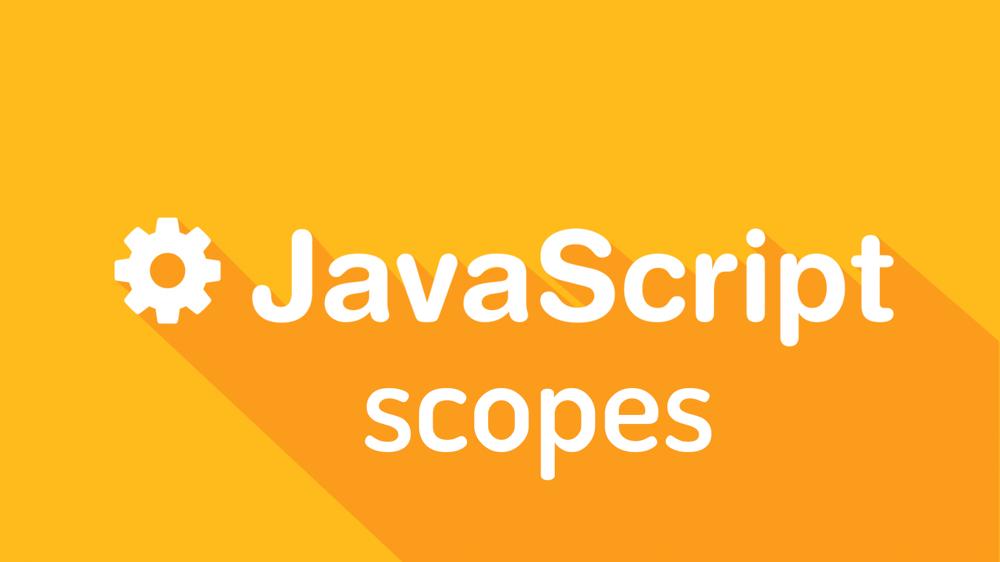

# Scope



Javascript có một vài khái niệm liên quan đến "Scope", không một khái niệm nào trong số chúng là dễ hiểu đối với một newbier , thậm chí là cả những JS dev đã có kinh nghiệm. Trong bài viết này, tôi sẽ cố gắng giải thích cặn kẽ nhất về các khái niệm liên quan đến Scope trong JS. Bài viết hướng tới những ai muốn tìm hiểu sâu hơn về các từ như là `scope`, `closure`, `this`, `namespace`, `function scope`, `global scope`, `lexical scope` and `public/private scope`. 

Hi vọng sẽ giúp ích cho các bạn khi muốn giải đáp những câu hỏi:

* What is Scope?
* What is Global/Local Scope?
* What is a Namespace and how does it differ to Scope?
* What is the this keyword and how does Scope affect it?
* What is Function/Lexical Scope?
* What are Closures?
* What is Public/Private Scope?
* How can I understand/create/do all of the above?

Trước hết, ta sẽ bắt đầu với những khái niệm cơ bản:

### What is scope?

Trong JS, scope đề cập đến ngữ cảnh hiện tại trong code của bạn. Scope có thể được xác định trên _toàn cục_ hoặc _cục bộ_. Hiểu về scope trong js là chìa khóa để viết code chống lỗi và trở thành developer tốt hơn. Bạn sẽ hiểu được ở đâu variables/functions có thể được truy cập, có thể thay đổi scope của ngữ cảnh trong code của bạn, nói nôm na là có thể viết code nhanh hơn và dễ maintain hơn, cũng như debug dễ dàng hơn. 

Suy nghĩ về scope dễ dàng như chúng ta đang trong `scope A` hay `scope B`?

### What is global scope?

Trước khi bạn viết một dòng code JS, bạn đang ở nơi mà chúng ta gọi là `global scope`. Nếu chúng ta khai báo một biến, biến đó sẽ được hiểu là biến Global:

```javascript
// global scope
var name = 'JS';
```

Global scope vừa là bạn tốt cũng vừa là cơn ác mộng tồi tệ đối với bạn, hiểu đúng về nó sẽ giúp bạn tránh khỏi các vấn đề với global scope \(thường là đụng độ namespaces\). Bạn thường nghe mọi người than vãn " Global scope thật là tồi tệ ..", nhưng lại không hiểu tại sao. Thực sự thì Global scope không phải là tồi tệ, bạn cần nó để tạo nên các Modules/ API truy cập thông qua các scopes. Bạn phải sử dụng nó như là lợi thế của mình và không có vấn đề trở ngại nào.

Nếu đã từng dùng jQuery và ngay khi làm thế này ...

```javascript
jQuery('.myClass');
```

... bạn đang truy cập JQuery ở global scope, chúng ta có thể truy cập như một `namespace`. Namespace đôi khi có thể hoán đổi cho từ "scope", thường là đề cập đến scope mức cao nhất. Trong trường hợp này, `jQuery` nằm trong global scope và cũng là namespace của chúng ta. Namespace `jQuery` được định nghĩa trong global scope, hoạt động như một namespace cho thư viện jQuery vì mọi thứ bên trong đều trở thành phần tử con của namespace đó.

### What is local scope?

Local scope đề cập đến bất kỳ scope nào được xác định qua global scope. Có một global scope, và mỗi function định nghĩa bên trong chúng \(nested\) local scope. Bất cứ function nào được định nghĩa bên trong một function khác đều có local scope được kết nối với function bên ngoài. Nếu tôi định nghĩa một function và tạo các biến bên trong nó, các biến đấy trở thành local scope. Ví dụ:

```javascript
// Scope A: Global scope out here
var myFunction = function () {
  // Scope B: Local scope in here
};
```

Bất kỳ scope items nào cũng đều không tồn tại, hay nói cách khác là không hiểu được ở global scope - trừ khi được truyền ra ngoài, điều đó có nghĩa là nếu tôi định nghĩa một function hoặc một variable trong một scope mới, thì nó không thể được truy cập từ scope bên ngoài scope hiện tại \(scope mới được tạo\). Một ví dụ đơn giản:

```javascript
var myFunction = function () {
  var name = 'Todd';
  console.log(name); // Todd
};
// Uncaught ReferenceError: name is not defined
console.log(name);
```

Kết quả chỉ ra rằng, ở global scope không thể truy cập đến biến `name` local scope bên trong `myFunction()`.

### Function scope

Tất cả các scope trong JS chỉ được tạo ra bởi `Function scope` , chúng không được tạo ra bởi các vòng lặp `for`, `while` hay bởi các biểu thức như `if`, `switch`. Một function mới = một scope mới, đó là quy tắc. Một ví dụ cho function scope:

```javascript
// Scope A
var myFunction = function () {
  // Scope B
  var myOtherFunction = function () {
    // Scope C
  };
};
```

### Lexial scope

Tiếp theo ta sẽ tìm hiểu về `Lexical scope`. Khi bạn nhìn thấy một function bên trong một function khác, function bên trong có thể truy cập đến scope của function bên ngoài, đó gọi là Lexical Scope hay là Closure - còn được gọi là Static Scope. Ví dụ dưới đây sẽ mô tả điều này:

```javascript
// Scope A
var myFunction = function () {
  // Scope B
  var name = 'Todd'; // defined in Scope B
  var myOtherFunction = function () {
    // Scope C: `name` is accessible here!
  };
};
```

Bạn sẽ nhận thấy rằng, `myOtherFunction` không được gọi ở đây, mà nó chỉ được định nghĩa. Lệnh gọi nó cũng có ảnh hưởng đến các biến được gọi. Dưới đây là ví dụ về cách truy cập đến các biến:

```javascript
var myFunction = function () {
  var name = 'Todd';
  var myOtherFunction = function () {
    console.log('My name is ' + name);
  };
  console.log(name);
  myOtherFunction(); // call function
};

// Will then log out:
// `Todd`
// `My name is Todd`
```

Làm việc với Lexical scope cũng khá là dễ dàng, các biến/object/ function được định nghĩa ở parent scope, đều có sẵn trong scope chain. Để dễ tưởng tượng hơn, hãy theo dõi biến `name` trong ví dụ:

```javascript
var name = 'Todd';
var scope1 = function () {
  // name is available here
  var scope2 = function () {
    // name is available here too
    var scope3 = function () {
      // name is also available here!
    };
  };
};
```

Điều quan trọng nhất cần phải nhớ là Lexical scope không làm theo chiều ngược lại. Hãy theo dõi ví dụ theo hướng ngược lại:

```javascript
// name = undefined
var scope1 = function () {
  // name = undefined
  var scope2 = function () {
    // name = undefined
    var scope3 = function () {
      var name = 'Todd'; // locally scoped
    };
  };
};
```

Bạn có thể return một tham chiếu đến biến `name` chứ không thể là chính nó.

### Scope Chain

Scope chain thiết lập cho mỗi scope một function nhất định. Mỗi function lại định nghĩa nested scope riêng như ta đã biết, và mỗi function được định nghĩa trong một function khác đều là local scope được liên kết với function bên ngoài - sự kết nối ấy được gọi là chain. Khi giải quyết một biến, JS bắt đầu với scope bên trong, sau đó tìm kiếm dần mở rộng ra bên ngoài cácbiến/object/function cho đến khi chúng được tìm thấy.

### Closures

Closures có mối quan hệ rất chặt chẽ với Lexical scope. Một ví dụ tốt để hiểu làm thế nào mọi thứ bên _Closure_ hoạt động. Có thể thấy khi trả về _function reference_. Bên trong một scope, chúng ta có thể truy cập bất cứ gì đã khai báo ở scope cha:

```javascript
var sayHello = function (name) {
  var text = 'Hello, ' + name;
  return function () {
    console.log(text);
  };
};
```

Khái niệm _closure_ chúng ta sử dụng ở đây để chỉ scope bên trong mà `sayHello` không thể truy cập từ scope public. Khi gọi function sẽ không trả về gì:

```javascript
sayHello('Todd'); // nothing happens, no errors, just silence...
```

kết quả khi gọi `sayHello()` trả về 1 function, điều đó có nghĩa là nó cần được gán:

```javascript
var helloTodd = sayHello('Todd');
helloTodd(); // will call the closure and log 'Hello, Todd'
```

Tuy nhiên ta cũng có thể gọi bằng cách sử dụng cú pháp của IIFE:

```javascript
sayHello('Bob')(); // calls the returned function without assignment
```

AngularJS sử dụng kỹ thuật trên cho phương thức **$complier**, khi bạn muốn truyền tham chiếu scope hiện tại vào closure. 

```typescript
$compile(template)(scope);
```

Ta có thể suy đoạn đoạn code của họ như thế này :

```typescript
var $compile = function (template) {
  // some magic stuff here
  // scope is out of scope, though...
  return function (scope) {
    // access to `template` and `scope` to do magic with too
  };
};
```

### Scope and this

Mỗi scope sẽ hiểu với một biến `this` khác nhau phụ thuộc vào scope được gọi như thế nào. Có thể bạn đã từng dùng `this` rất nhiều lần, tuy nhiên không chắc bạn đã hiểu hết mỗi `this` khác nhau thế nào khi được gọi. Theo mặc định thì `this` là một biến thuộc global scope, đó là `window`. Chúng ta có thể dễ dàng chỉ ra các functions được gọi thế nào theo nhiều cách liên kết khác nhau biến `this` có giá trị khác nhau:

```javascript
var myFunction = function () {
  console.log(this); // this = global, [object Window]
};
myFunction();

var myObject = {};
myObject.myMethod = function () {
  console.log(this); // this = Object { myObject }
};

var nav = document.querySelector('.nav'); // <nav class="nav">
var toggleNav = function () {
  console.log(this); // this = <nav> element
};
nav.addEventListener('click', toggleNav, false);
```

Cũng có một vài vấn đề ta phải đối mặt khi sử dụng `this`, trong trường hợp nếu tôi sử dụng `this`, thậm chí trong cùng function thì scope cũng có thể thay đổi, và giá trị `this` cũng thay đổi giá trị:

```javascript
var nav = document.querySelector('.nav'); // <nav class="nav">
var toggleNav = function () {
  console.log(this); // <nav> element
  setTimeout(function () {
    console.log(this); // [object Window]
  }, 1000);
};
nav.addEventListener('click', toggleNav, false);
```

Bạn có thể thấy `this` trong hai trường hợp, nếu nhìn qua thì có thể nói là "cùng scope", tuy nhiên, kết quả thật sự lại khác. Vậy chuyện gì đã làm thay đổi giá trị của `this`. Chúng ta đã tạo một new scope và nó không được gọi từ event handler của chungs ta, do đó mặc định là `window` Object. Ở đây có một vài điều ta có thể làm nếu muốn truy cập giá trị của `this` phù hợp mà không bị ảnh hưởng bới new scope. Bằng cách gán giá trị của `this` ở thời điểm nào đó bằng một biến, ở đây tôi dùng `that`:

```javascript
var nav = document.querySelector('.nav'); // <nav class="nav">
var toggleNav = function () {
  var that = this;
  console.log(that); // <nav> element
  setTimeout(function () {
    console.log(that); // <nav> element
  }, 1000);
};
nav.addEventListener('click', toggleNav, false);
```

Đây là cách có thể bạn đã thấy, bằng cách này, giá trị mang tính "tạm thời" của `this` đã được giải quyết.

### Changing scope with .call, .apply\(\) and .bind\(\)

Đôi khi bạn cần điều khiển các scope phụ thuộc vào những gì bạn đang tìm kiếm. Một ví dụ mô tả:

```javascript
var links = document.querySelectorAll('nav li');
for (var i = 0; i < links.length; i++) {
  console.log(this); // [object Window]
}
```

#### **.call\(\) and .apply\(\)** 

`call()` và `apply()` cho phép chúng ta truyền một scope vào trong một function mà ràng buộc đúng giá trị `this` này. Hãy vận dụng function bên trên để tạo biến `this` của chúng ta:

Giá trị `this` ở đây không đề cập đến các phần tử của chúng ta, nó đang gọi đến object Window. Để gọi được các element, ta phải thay đổi scope của chúng.

```javascript
var links = document.querySelectorAll('nav li');
for (var i = 0; i < links.length; i++) {
  (function () {
    console.log(this);
  }).call(links[i]);
}
```

Cách sử dụng `call()` và `apply()` khá giống nhau, tuy nhiên có một điểm khác đó là: các tham số truyền vào cho hàm `call()` là từng biến riêng lẻ, còn đối với `apply()` thì ta có thể truyền theo mảng: `.call(scope, arg1, arg2, arg3)`, `.apply(scope, [arg1, arg2])`.

Điều quan trọng cần phải nhớ khi sử dụng `call()` và `apply()` đó là nó đã thực sự gọi function của bạn, thay cho câu lệnh goị function:

```javascript
myFunction(); // invoke myFunction
```

Bạn sẽ để `.call()` xử lý nó và chuỗi các method:

```javascript
myFunction.call(scope); // invoke myFunction using .call()
```

#### **.bind\(\)**

khi dùng `bind()` sẽ không gọi \(invoke\) function của bạn, và nó cũng có tác dụng truyền vào các đối số. Như ví dụ dưới đây:

```javascript
// works
nav.addEventListener('click', toggleNav, false);

// will invoke the function immediately
nav.addEventListener('click', toggleNav(arg1, arg2), false);
```

Ta có thể sửa lại để function không bị gọi ngay taị thời thời điểm nó được định nghĩa:

```javascript
nav.addEventListener('click', function () {
  toggleNav(arg1, arg2);
}, false);
```

Nhưng với sự thay đổi như trên, thì ta lại tạo ra một function thực sự không cần thiết, điều này sẽ thực sự kém về performance nếu chúng ta đang ở trong một vòng lặp mà các sự kiện listener đang được ràng buộc. Để giải quyết thì ta sẽ vận dụng `.bind()`:

```javascript
nav.addEventListener('click', toggleNav.bind(scope, arg1, arg2), false);
```

Bằng cách này, function sẽ không bị gọi ngay, các scopes cũng được thay đổi nếu cần, tuy nhiên, các đối số lại phải chờ để được duyệt đến.

